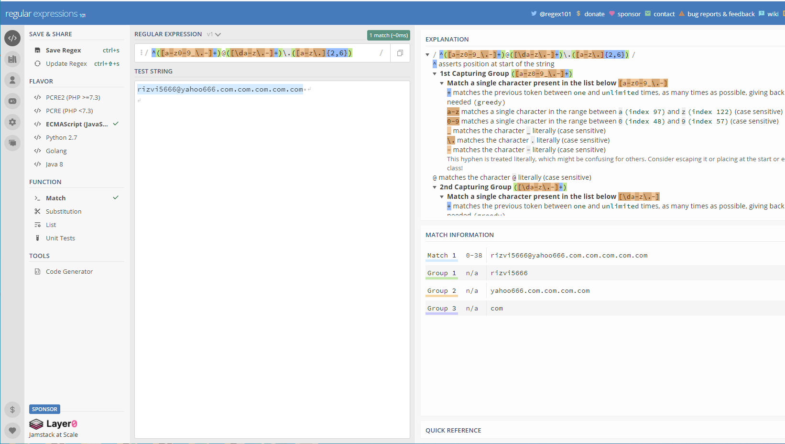
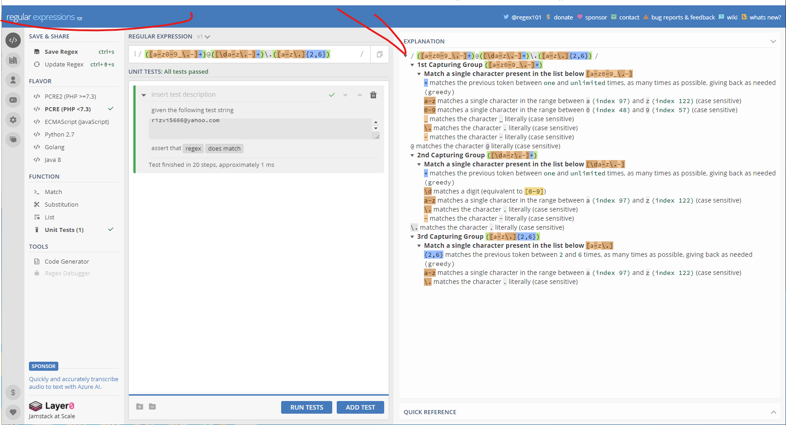

# Regular Expression to Validate an Email

The regular expression allows programers to check a serires of characters in a string by following the prescribed rules of 'matching' 
the expressions.
The expression usually include symbol @ and .com extensions in a email. They help users to enter email
possibly in a right format without any  mistakes. Hence , the email enry is validated.

## Summary
The following regular expressions are matched to validate an email. See the attached examples for the results.
An email is usually divided ito three groups such as :

Group-1 @ Group-2 . Group3.

The symbols @ and . are literal match in a regular expression for an email validation.

Example-1
 
/^([a-z0-9_\.-]+)@([\da-z\.-]+)\.([a-z\.]{2,6})/`

Example-2
 
/([a-z0-9_\.-]+)@([\da-z\.-]+)\.([a-z\.]{2,6})/`

- [Anchors](#anchors)
- [Quantifiers](#quantifiers)
- [Grouping Constructs](#grouping-constructs)
- [Bracket Expressions](#bracket-expressions)
- [Character Classes](#character-classes)
- [The OR Operator](#the-or-operator)
- [Flags](#flags)
- [Character Escapes](#character-escapes)

## Regex Components

### Anchors

The characters ^ and $ both considered to be anchors. They are used in the beginning and at the end of the regular expression. They are basically used to limit the testing of regular expression . They are placed between the two forward slashes as follows:

/ ^ [ regualr expression to be tested]$ /

### Quantifiers
 Quntifieres set the limits of characters that one want to match in a regular expression.  The following are most fequenly used quantifiers.

 *  Matches the pattren from zero to more times.
 for example :
 a* will match all the lower case a's in the following strig:
 aaaaaaaaaaaaaaaaaaaaaaaaaaaaa 

 the poular quantifiers are:
 + Matches the pattren one or more times
  
 ? Matches the pattren zero or one time 

 {2,3}  This quantifier matches the pattren from minimum of 2 to maximum of 3.

### Grouping Constructs

A section of regular expression is grouped by placing it within the parentheses : (())

### Bracket Expressions
The expression placed in the square brackets [] represents the range of expression matched. 
For example the rgular expression reprensed by [a-z0-9_] will match all the lower case letters , all the digits 0 to 9 and the underscor.

### Character Classes

Th bracket expression described above includes both positive and negative chracters groups , are considered character classes. 
[^abc] is a negative chracter class. The common character classes are as follows:

\d  Matches any digit . This class is equivalent to bracket class [0-9]

\w  Matches any alphanumeric character incluing the underscore.  Thsi class is equivalent to the bracket class [A-Za-z0-9_]

\s  Matches a single white space chracteter, inclding tabs and link breaks.

### The OR Operator
The OR operator (|) can be used to include more flexability in the regular expression . The expression [abc] could be written as 
(a|b|c).

### Flags
The most used flags in regex are as folows:
g: Represents global search : The regex sould be tested against all possible matches.

i: This represents the case insensitive serach.

m: Multi line search

### Character Escapes
 The back slash (\) in regex ecapes a character. Witout a backslash the character will be considered literally.

## Author

The autor of this tutorial is a Rice University boot-camp student who wants to become a full-stack web developer.

The link to Autor's GITHUB profile is:
https://github.com/rizvi5a

 alt="test1">
 alt="test2">